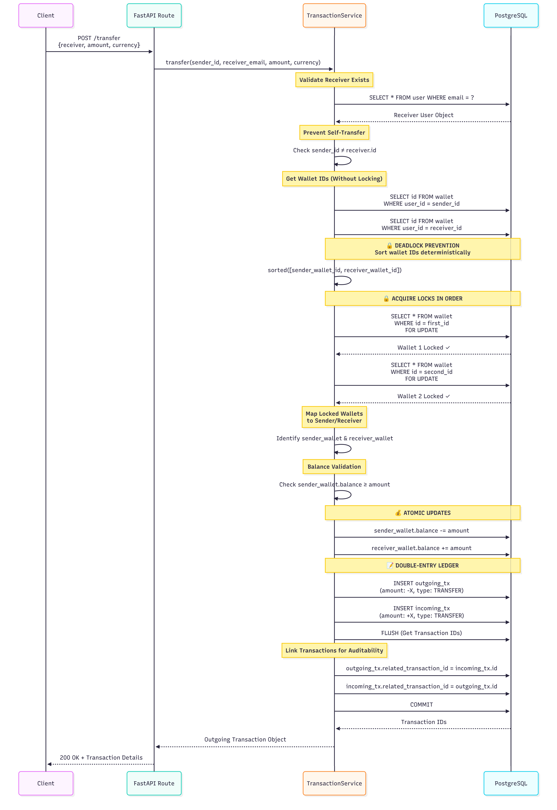

# VaultCore

[](https://www.python.org/)
[](https://fastapi.tiangolo.com/)
[](https://www.postgresql.org/)
[](https://opensource.org/licenses/MIT)

> **A high-performance, production-grade e-wallet core system engineered for financial integrity, concurrency safety, and strict ACID compliance.**

---

## Executive Summary

VaultCore is an enterprise-level backend engine designed to handle mission-critical financial operations with zero compromise on data integrity. Built from the ground up to solve the hardest challenges in concurrent financial systems—**race conditions**, **deadlocks**, and **double-spending**—this system is architected for banks, fintech platforms, and payment processors that demand absolute correctness.

Unlike typical CRUD applications, VaultCore implements **database-level row locking**, **deterministic resource ordering**, and **double-entry bookkeeping** to ensure that even under extreme concurrent load, every cent is accounted for.

---

## System Architecture

### Transfer Transaction Flow (with Deadlock Prevention)



**Key Design Decisions:**

- **Deterministic Lock Ordering**: Prevents deadlocks when User A → User B and User B → User A transfer simultaneously.
- **Row-Level Locking (`FOR UPDATE`)**: Prevents double-spending in race conditions.
- **Double-Entry Accounting**: Every transfer creates two linked transactions for full audit trails.

---

## Key Features

### Security & Authentication

- **Advanced RBAC System**: Custom Role-Based Access Control with weighted hierarchy (Superuser > Admin > Staff > User)
- **JWT Token Management**: Secure access & refresh tokens stored in `HttpOnly` cookies
- **Token Versioning**: Immediate revocation capability via version increment (invalidates all user sessions)
- **Token Blacklisting**: Revoked tokens stored in database to prevent reuse
- **Email Verification**: Account activation workflow with templated emails
- **Bcrypt Password Hashing**: Industry-standard password protection

### Financial Operations (Race-Condition Safe)

- **Deposit**: Add funds to user wallets with automatic balance updates
- **Withdrawal**: Deduct funds with insufficient balance protection
- **P2P Transfers**: User-to-user transfers with bi-directional locking
- **Multi-Currency Support**: Independent wallets per currency (USD, EUR, etc.)
- **Transaction History**: Complete audit trail with balance snapshots

### Data Integrity Guarantees

- **ACID Transactions**: Atomicity, Consistency, Isolation, Durability on all operations
- **Row-Level Locking**: `SELECT ... FOR UPDATE` prevents concurrent modification conflicts
- **Deadlock Prevention**: Deterministic wallet ordering algorithm eliminates circular wait conditions
- **Decimal Precision**: `NUMERIC(18,4)` data types (NO floating-point errors)
- **Double-Entry Ledger**: Linked debit/credit transaction pairs via `related_transaction_id`
- **Balance Snapshots**: Every transaction records `balance_after` for point-in-time reconciliation

### Architecture & Design Patterns

- **Service-Repository Pattern**: Clear separation of API logic, business logic, and data access
- **Modular Design**: Routes, Services, Schemas, Models, Utils organized for scalability
- **Pydantic Validation**: Request/response schema validation with type safety
- **SQLAlchemy ORM**: Database abstraction with relationship management
- **Alembic Migrations**: Version-controlled schema evolution
- **Dependency Injection**: FastAPI's DI system for database sessions and authentication

---

## Database Schema


**Schema Highlights:**

- **Unique Constraint**: `(user_id, currency)` on Wallet prevents duplicate currency wallets
- **Self-Referencing FK**: `related_transaction_id` links transfer debit/credit pairs
- **Cascading Deletes**: User deletion cascades to Wallets → Transactions
- **Weighted Roles**: Integer weights enable hierarchical permission checks

---

## Installation & Setup

### Prerequisites

- Python 3.11+
- PostgreSQL 15+
- Git

### Step 1: Clone Repository

```bash
git clone https://github.com/yourusername/vaultcore.git
cd vaultcore
```

### Step 2: Create Virtual Environment

```bash
python -m venv venv
source venv/bin/activate  # On Windows: venv\Scripts\activate
```

### Step 3: Install Dependencies

```bash
pip install -r requirements.txt
```

### Step 4: Environment Variables

Create a `.env` file in the project root:

```env
SECRET_KEY=your_secret_key_here
DATABASE_USERNAME=your_database_username
DATABASE_PASSWORD=your_database_password
DATABASE_SERVER_IP=localhost
DATABASE_PORT=5432
DATABASE_NAME=your_database_name
ACCESS_TOKEN_EXPIRE=30 # in minutes
REFRESH_TOKEN_EXPIRE=7200 # in minutes
ALGORITHM=HS256
SUPERUSER_USERNAME=your_superuser_username
SUPERUSER_EMAIL=your_superuser_email
SUPERUSER_FIRST_NAME=your_first_name
SUPERUSER_MIDDLE_NAME=your_middle_name
SUPERUSER_LAST_NAME=your_last_name
SUPERUSER_PASSWORD=your_superuser_password
MAIL_USERNAME=your_email@example.com
MAIL_PASSWORD=your_email_app_password
MAIL_FROM=your_email@example.com
MAIL_PORT=587
MAIL_SERVER=smtp.gmail.com
MAIL_FROM_NAME=Your_App_Name
```

### Step 5: Database Migrations

```bash
# Initialize Alembic (if not done)
alembic init alembic

# Generate migration
alembic revision --autogenerate -m "Initial schema"

# Apply migrations
alembic upgrade head
```

### Step 6: Run Development Server

```bash
uvicorn main:app --reload --host 0.0.0.0 --port 8000
```

API will be available at `http://localhost:8000`  
Interactive docs at `http://localhost:8000/docs`

### Alternative: Running with Docker

1.  **Configure Environment Variables**:
    Ensure your `.env` file is set up as described in **Step 4**.

2.  **Start Services**:

    ```bash
    docker-compose up -d --build
    ```

    This automatically runs migrations and starts the application.

3.  **Access the Application**:
    - API: `http://localhost:8000`
    - Swagger Docs: `http://localhost:8000/docs`

---

## API Endpoints Overview

### Authentication

| Method | Endpoint                              | Description                | Auth Required |
| ------ | ------------------------------------- | -------------------------- | ------------- |
| POST   | `/api/v1/auth/register/`              | Create new user account    | No            |
| POST   | `/api/v1/auth/token`                  | Login & receive JWT tokens | No            |
| GET    | `/api/v1/auth/refresh`                | Refresh access token       | Yes (Refresh) |
| POST   | `/api/v1/auth/logout`                 | Logout & revoke tokens     | Yes           |
| PUT    | `/api/v1/auth/change-password`        | Change user password       | Yes           |
| POST   | `/api/v1/auth/verify-email/`          | Request email verification | Yes           |
| GET    | `/api/v1/auth/verify-email/`          | Confirm email verification | No (Token)    |
| POST   | `/api/v1/auth/forgot-password`        | Request password reset     | No            |
| POST   | `/api/v1/auth/reset-password-confirm` | Confirm password reset     | No (Token)    |
| POST   | `/api/v1/auth/request-email-change`   | Request email change       | Yes           |
| GET    | `/api/v1/auth/confirm-email-change`   | Confirm email change       | No (Token)    |

### Wallet Management

| Method | Endpoint                     | Description            | Auth Required |
| ------ | ---------------------------- | ---------------------- | ------------- |
| POST   | `/api/v1/wallets/`           | Create currency wallet | Yes           |
| GET    | `/api/v1/wallets/`           | List user's wallets    | Yes           |
| GET    | `/api/v1/wallets/{currency}` | Get specific wallet    | Yes           |

### Transactions

| Method | Endpoint                       | Description    | Auth Required |
| ------ | ------------------------------ | -------------- | ------------- |
| POST   | `/api/v1/transaction/deposit`  | Deposit funds  | Yes           |
| POST   | `/api/v1/transaction/withdraw` | Withdraw funds | Yes           |
| POST   | `/api/v1/transaction/transfer` | P2P transfer   | Yes           |

### User Management

| Method | Endpoint                             | Description              | Auth Required    |
| ------ | ------------------------------------ | ------------------------ | ---------------- |
| GET    | `/api/v1/users/`                     | List all users           | Yes (Permission) |
| GET    | `/api/v1/users/me/`                  | Get current user profile | Yes              |
| PUT    | `/api/v1/users/me/`                  | Update profile           | Yes              |
| GET    | `/api/v1/users/get_user/{username}/` | Get user by username     | Yes (Permission) |

---

## Testing

### Manual Testing (Postman/Thunder Client)

1. Import the API collection from `/docs` (Swagger JSON export)
2. Set environment variables for `base_url` and `access_token`
3. Run requests in sequence: Register → Login → Create Wallet → Deposit → Transfer

## Future Roadmap

### Phase 1: Infrastructure

- [x] **Dockerization**: Multi-stage Dockerfile + docker-compose for PostgreSQL
- [ ] **CI/CD Pipeline**: GitHub Actions for automated testing & deployment
- [ ] **Unit & Integration Tests**: Pytest test suite with 80%+ coverage
- [ ] **API Rate Limiting**: Redis-based throttling (100 req/min per user)

### Phase 2: Features

- [ ] **Webhook Notifications**: Real-time transaction alerts via webhooks
- [ ] **Transaction Disputes**: Dispute filing & resolution workflow
- [ ] **CSV Export**: Transaction history export for accounting
- [ ] **Scheduled Payments**: Cron-based recurring transfers
- [ ] **Currency Conversion**: Real-time FX rates integration

### Phase 3: Scalability

- [ ] **Read Replicas**: Distribute read queries to PostgreSQL replicas
- [ ] **Event Sourcing**: Replace direct DB writes with event log (Kafka/RabbitMQ)
- [ ] **Horizontal Scaling**: Load balancer + multiple FastAPI instances
- [ ] **Monitoring**: Prometheus metrics + Grafana dashboards
- [ ] **Distributed Tracing**: OpenTelemetry for request tracing

---

## Technical Deep Dive

### Why Row-Level Locking?

```python
# ❌ WITHOUT LOCKING (Race Condition)
# Thread 1: wallet.balance = 100, withdraw 50 → balance = 50
# Thread 2: wallet.balance = 100, withdraw 50 → balance = 50
# Result: 100 withdrawn, balance = 50 (Lost update!)

# ✅ WITH LOCKING
wallet = db.query(Wallet).with_for_update().first()  # Blocks Thread 2
# Thread 1: wallet.balance = 100, withdraw 50 → balance = 50, COMMIT
# Thread 2: wallet.balance = 50, withdraw 50 → FAIL (Insufficient funds)
```

### Deadlock Prevention Algorithm

```python
# Scenario: User A → User B, User B → User A (simultaneous)
# Without ordering:
#   Transaction 1: Lock(Wallet A) → Lock(Wallet B) [WAITING]
#   Transaction 2: Lock(Wallet B) → Lock(Wallet A) [WAITING]
#   Result: DEADLOCK

# Solution: Always lock in ascending ID order
wallet_ids = sorted([sender_wallet_id, receiver_wallet_id])
wallet_1 = db.query(Wallet).filter(id == wallet_ids[0]).with_for_update()
wallet_2 = db.query(Wallet).filter(id == wallet_ids[1]).with_for_update()
# Result: Both transactions lock in same order → No circular wait
```

---

## License

MIT License - See [LICENSE](LICENSE) file for details.

---

## Contributing

Contributions are welcome! Please follow these steps:

1. Fork the repository
2. Create a feature branch (`git checkout -b feature/YourFeature`)
3. Commit changes (`git commit -m 'Add YourFeature'`)
4. Push to branch (`git push origin feature/YourFeature`)
5. Open a Pull Request

Please ensure:

- Migrations are included for schema changes

---

## Contact

For questions or support, reach out via:

- **Email**: alsaeedhasan@beng.bu.edu.eg
- **GitHub Issues**: [Create an issue](https://github.com/AlsaeedHasan/vaultcore/issues)

---

<div align="center">

**Built for financial integrity**

[★ Star this repo](https://github.com/AlsaeedHasan/vaultcore) if you found it useful!

</div>
